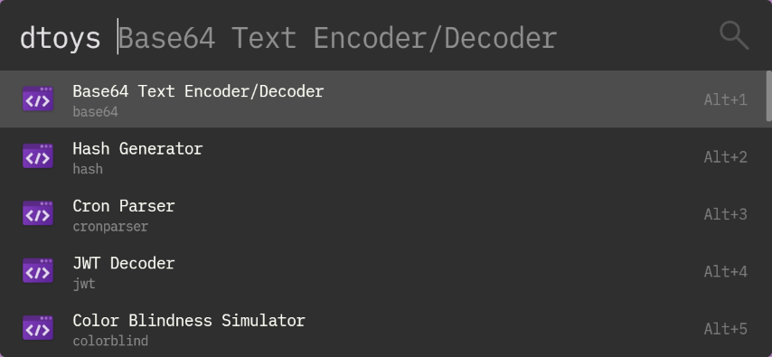

DevToys Launcher (Flow.Launcher.Plugin.DevToysLauncher)
====================================================

Launch [DevToys](https://devtoys.app/) tools from [Flow Launcher](https://flow-launcher.github.io/).




Install
-------

[DevToys app](https://www.microsoft.com/store/apps/9pgcv4v3bk4w) must be installed.


```
pm install devtoys launcher
```


Usage
-----

```
dtoys <tool name>
```

See [DevToys repo](https://github.com/veler/DevToys#using-powershell) for list of tool names.


### Internationalization

You can switch language in which tool name is displayed in launcher by plugin config file.

Plugin config file at Flow Launcher userdata folder. (You can locate it quickly via querying `flow launcher userdata` )

Config file location: `<Flow Launcher UserData Folder>\Plugins\DevToysLauncher-<version>\.env`

```
local=en  # en or ja
```

Currently, English ( `en` ) and Japanese ( `ja` ) are supported.


- - -

This plugin was created based on [Flow-Launcher/Flow.Launcher.Plugin.PythonTemplate](https://github.com/Flow-Launcher/Flow.Launcher.Plugin.PythonTemplate).

The icon was borrowed from [DevToys repository](https://github.com/veler/DevToys).
